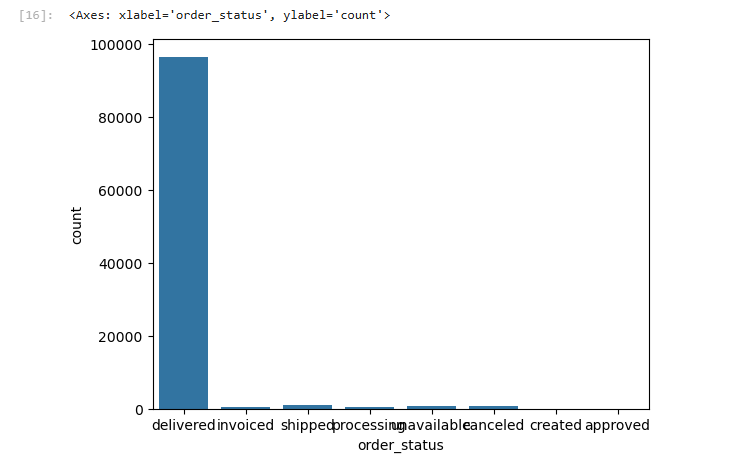
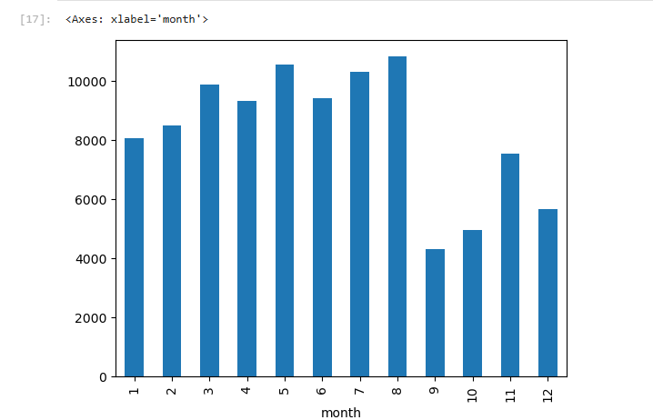

# Olist E-commerce Data Analysis (Python)

## Project Overview

This project analyzes Brazilian e-commerce data to understand order trends, customer behavior, and delivery performance.

The goal of the analysis is to identify operational insights from the dataset such as order status distribution, monthly order trends, and delivery performance.

Dataset Source: Olist Brazilian E-commerce Dataset.

---

## Tools and Technologies

Python
Pandas
NumPy
Matplotlib
Seaborn
Jupyter Notebook

---

## Data Cleaning and Preparation

The following preprocessing steps were performed:

* Loaded datasets using Pandas
* Checked dataset structure and column data types
* Handled missing values
* Removed duplicate records
* Converted timestamp columns to datetime format
* Created a new feature **delivery_days** to measure delivery time

---

## Exploratory Data Analysis

The analysis focuses on answering important business questions such as:

* What is the distribution of order status?
* How do orders vary month by month?
* How long does delivery typically take?

---

## Visualizations

### Order Status Distribution

This chart shows the number of orders in each order status category.

---

### Monthly Orders Trend

This visualization shows how the number of orders changes across months.

---

### Delivery Time Distribution

This chart shows how delivery time varies across orders.

---

## Key Insights

* Most orders are successfully delivered, indicating a reliable fulfillment process.
* Monthly order trends show seasonal fluctuations in demand.
* Delivery time distribution highlights variability in logistics performance.
* Only a small percentage of orders are cancelled or unavailable.

---

## Project Structure

olist-ecommerce-python-analysis

data
├── olist_orders_dataset.csv
└── olist_customers_dataset.csv

image
├── order_status_chart.png
├── monthly_orders_chart.png
└── deliveryTimeDistributionChart.png

notebooks
└── ecommerce_analysis.ipynb

README.md

---

## Author

Dheeraj N
Aspiring Data Analyst

Skills:
Python | SQL | Excel | Power BI | Tableau | Data Analysis

